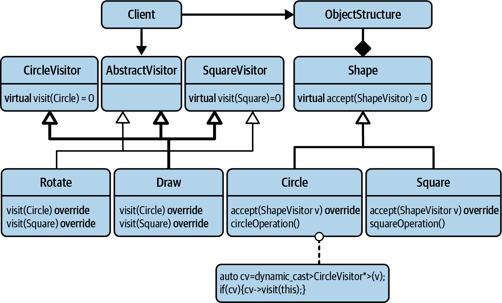

# Acyclic Visitor

There is a cyclic dependency among the key players of the Visitor design pattern


- The `Visitor` base class depends on the concrete types of shapes (`Circle`, `Square`, etc.)
- The concrete types of shapes depend on the `Shape` base class, and
- The `Shape` base class depends on the `Visitor` base class.

Due to that cyclic dependency, which locks all those key players onto one level in the architecture, it is hard to add new types to a Visitor. 

The idea of the Acyclic Visitor is to break this dependency.



Most importantly, the `Visitor` base class has been split into several base classes: 

- The `AbstractVisitor` base class and one base class for each concrete type of shape (in this example, `CircleVisi⁠tor` and `SquareVisitor`).
- All visitors have to inherit from the `AbstractVisitor` base class but now also have the option to inherit from the shape-specific visitor base classes.
- The `AbstractVisitor` base class is nothing but an empty base class with a virtual destructor. 
  - No other function is necessary. As you will see, `AbstractVisitor` serves only as a general tag to identify visitors and doesn’t have to provide any operation itself. 
- In C++ we tend to implement the shape-specific visitor base classes in the form of a **class template**.
  - The Visitor class template is parameterized on a specific shape type and introduces the pure `virtual visit()` for that particular shape.

In the implementation of our `Draw` visitor, 

We would now inherit from three base classes: the `AbstractVisitor`, from `Visitor<Circle>` and `Visitor<Square>`, since we want to support both `Circle` and `Square`
```c++
class Draw : public AbstractVisitor,
             public Visitor<Circle>,
             public Visitor<Square>
{
public:
    void visit(Circle const& circle) const override
    {
        std::cout << "Draw a circle with radius " << circle.radius() << std::endl;
    }

    void visit(Square const& square) const override
    {
        std::cout << "Draw a square with side " << square.side() << std::endl;
    }
};
```


The high level of the architecture does not depend on the concrete shape types anymore. 

Both the shapes (`Circle` and `Square`) and the operations are now on the low level of the architectural boundary.

## Downside of Acyclic Visitor

- The `accept` function now accepts an `AbstractVisitor`.
  - Therefore, instead of calling a `visit()` function on the AbstractVisitor, the Circle determines if the given visitor supports circles by performing a `dynamic_cast` to `Visitor<Circle>`.
    ```c++
    void accept( AbstractVisitor const& v ) override {
      if( auto const* cv = dynamic_cast<Visitor<Circle> const*>(&v) ) {
         cv->visit( *this );  5
      }
    }
    ```

> While this approach most certainly works and is part of breaking the cyclic dependency of the Visitor design pattern, a `dynamic_cast` always leaves a bad feeling. 
> 
> A `dynamic_cast` should always feel a little suspicious, because, if used badly, it can break an architecture. 
That would happen if we perform a cast from within the high level of the architecture to something that resides in the low level of the architecture.⁠
In our case, it’s actually OK to use it, since the use happens on the low level of our architecture. 
Thus, we do not break the architecture by inserting knowledge about a lower level into the high level.