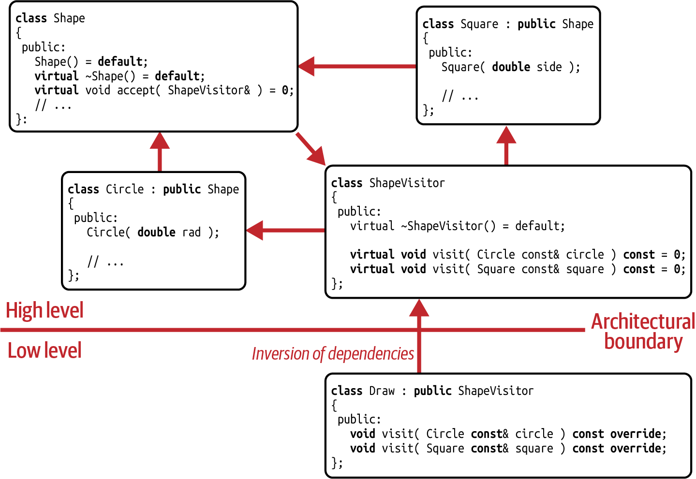

# The Visitor Design Pattern

The Visitor design pattern is one of the classic design patterns described by the Gang of Four (GoF). 

Its focus is on allowing you to **frequently add operations** instead of types.


- The `ShapeVisitor` base class comes with one pure virtual `visit()` function for every concrete shape in the Shape hierarchy.
- To enable drawing shapes, all you have to do is introduce a `Draw` class.
    - And you can think about introducing multiple `Draw` classes, one for each graphics library you need to support. 
    - You can do that easily, because you don’t have to modify any *existing code*. It is only necessary to extend the `ShapeVisitor` hierarchy by adding *new code*.

## Why Visitor design pattern fulfils OCP

The initial problem was that every new operation required a change to the `Shape` base class. 

Visitor identifies the addition of operations as a ***variation point***. By extracting this variation point, i.e., by making this a separate class, you follow the **Single-Responsibility Principle (SRP)**:

`Shape` does not have to change for every new operation. 

This avoids frequent modifications of the `Shape` hierarchy and enables the easy addition of new operations. 

The **SRP therefore acts as an enabler for the OCP.**

## Analyzing the shortcomings of the Visitor Design Pattern

The Visitor design pattern is unfortunately far from perfect. 

This should be expected, considering Visitor is a workaround for an intrinsic OOP weakness, instead of building on OOP strengths.

- The first disadvantage comes from the **LOW IMPLEMENTATION FLEXIBILITY.**
    
    It becomes obvious if you consider the implementation of a `Translate` visitor. 
    The `Translate` visitor needs to move the center point of each shape by a given offset.
    
    - For that, `Translate` needs to implement a `visit()` function for every concrete `Shape`.
    
        Especially for Translate, you can imagine that the implementation of these `visit()` functions would be very similar, if not identical:
        
        There is nothing different about translating a Circle from translating a Square.
    
    - Still, you will need to write all `visit()` functions.
    
        Of course, you would extract the logic from the `visit()` functions and implement this in a third, separate function to minimize duplication according to the DRY principle.

    But unfortunately, the strict requirements imposed by the base class do not give you the freedom to implement these `visit()` functions as one.

    ```c++
    class Translate : public ShapeVisitor
    {
    public:
    // Where is the difference between translating a circle and translating
    // a square? Still you have to implement all virtual functions...
    void visit( Circle const& c, /*...*/ ) const override;
    void visit( Square const& s, /*...*/ ) const override;
    // Possibly more visit() functions, one for each concrete shape
    };
    ```

- A similar implementation **inflexibility is the return type of the `visit()` functions.**
    The decision on what the function returns is made in the `ShapeVisitor` base class. Derived classes cannot change that. 
    
    The usual approach is to store the result in the visitor and access it later.

- The second disadvantage is that with the Visitor design pattern in place, **it becomes difficult to add new types**.
    
    > The Visitor design pattern requires a ***closed set*** of types and in exchange provides an ***open set*** of operations.
    
    Adding a new shape in the `Shape` hierarchy would require the entire `ShapeVisitor` hierarchy to be updated:
    
    You would have to **add a new pure virtual function** to the `ShapeVisitor` base class, and this virtual function would have to be implemented by all derived classes.

    > The underlying reason for this restriction is that there is a **cyclic dependency** among the `ShapeVisitor` base class, the concrete shapes (`Circle`, `Square`, etc.), and the `Shape` base class.

    

    - The `ShapeVisitor` base class depends on the concrete shapes, since it provides a `visit()` function for each of these shapes.
    - The concrete shapes depend on the `Shape` base class, since they have to fulfill all the expectations and requirements of the base class.
    - And the `Shape` base class depends on the `ShapeVisitor` base class due to the `accept()` function.

    > Because of this cyclic dependency, we are now able to add new operations easily (on a lower level of our architecture because of a *dependency inversion*), but we cannot add types easily anymore (because that would have to happen on the high level of our architecture).

    For that reason, we call the classic Visitor design pattern **Cyclic Visitor**.