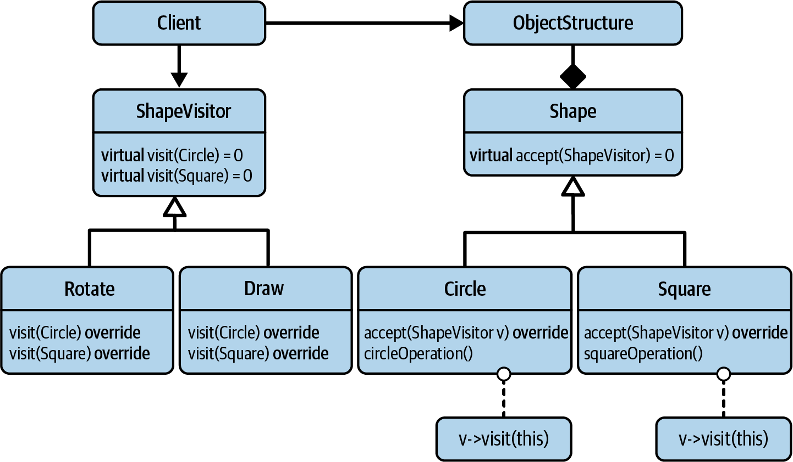

# The Visitor Design Pattern

The Visitor design pattern is one of the classic design patterns described by the Gang of Four (GoF). 

Its focus is on allowing you to **frequently add operations** instead of types.

- The `ShapeVisitor` base class comes with one pure virtual `visit()` function for every concrete shape in the Shape hierarchy.
- To enable drawing shapes, all you have to do is introduce a `Draw` class.
    - And you can think about introducing multiple `Draw` classes, one for each graphics library you need to support. 
    - You can do that easily, because you don’t have to modify any *existing code*. It is only necessary to extend the `ShapeVisitor` hierarchy by adding *new code*.

## Why Visitor design pattern fulfils OCP

The initial problem was that every new operation required a change to the `Shape` base class. 

Visitor identifies the addition of operations as a ***variation point***. By extracting this variation point, i.e., by making this a separate class, you follow the **Single-Responsibility Principle (SRP)**:

`Shape` does not have to change for every new operation. 

This avoids frequent modifications of the `Shape` hierarchy and enables the easy addition of new operations. 

The **SRP therefore acts as an enabler for the OCP.**