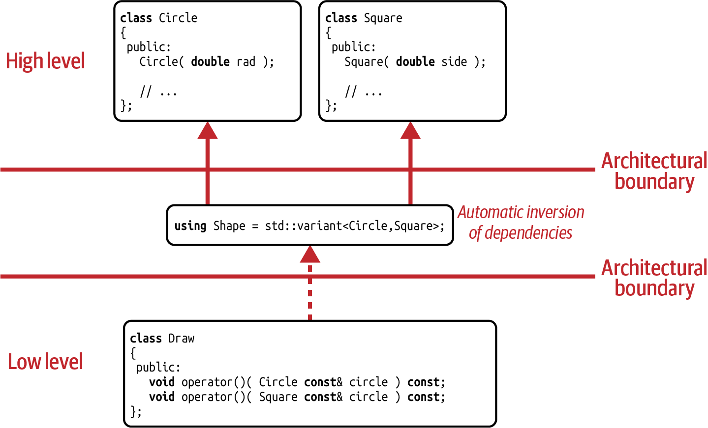

# Variant based Visitor Design Pattern

Again, we are following the expectation to implement one `operator()` for every alternative: 
- one for `Circle` and 
- one for `Square`. 

But this time we have a choice. 

> There is no need to implement any base class, and for that reason, **no need to override any virtual function.** 

Therefore, there is no need to implement exactly one `operator()` for every alternative. 

While in this example it feels reasonable to have two functions, we have the option to combine the two `operator()`s into one function. 

We also have a **choice with respect to the return type of the operation**. 

We can locally decide what we should return, and it is not a base class that, independent from the specific operation, makes a global decision. 

> **Implementation flexibility.**
> **Loose coupling.** 
> **Amazing!**

The `drawAllShapes()` function is refactored to make use of `std::visit()`. 

In this function, we now apply the `Draw` visitor onto all variants stored in a vector.

The job of `std::visit()` is to **perform the necessary type dispatch for you.** 

- If the given `std::variant` contains a `Circle`, it will call the `Draw::operator()` for circles.
- Otherwise it will call the `Draw::operator()` for squares.

The end result of this value-based solution is stunningly fascinating:
- No base classes anywhere. 
- No virtual functions. 
- No pointers. 
- No manual memory allocations.

Things are as straightforward as they could be, and there is very little boilerplate code.